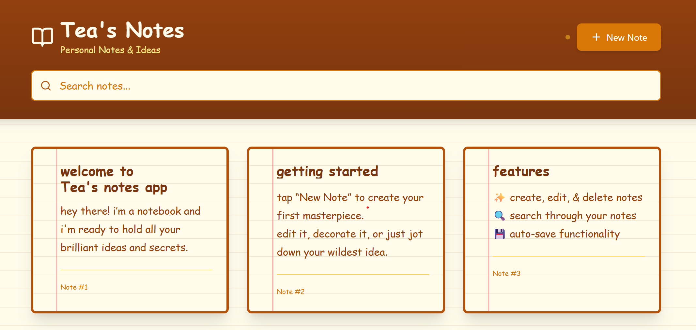

# Tea's Notes (FastAPI & REACT)

A simple, lightweight, full-stack Notes application built with a FastAPI backend and a React frontend. <br>
The project showcases core CRUD (Create, Read, Update, Delete) operations with a clean user interface and a simple, efficient API design.

<p align="center">

</p>

---

## Features
✔ Create Notes<br>
✔ View Notes<br>
✔ Update Notes<br>
✔ Delete Notes<br>

---

## How to Run the Project

### Backend

1. Install dependencies
   
  ```
  pip install fastapi uvicorn pydantic
  pip install -r requirements.txt

  ```

2. Start the FastAPI server
   
  ```
  uvicorn notesAPP:app --reload
  ```

3. Open your browser
   
  ```
  http://127.0.0.1:8000/docs
  ```

This displays interactive API documentation where you can test all endpoints.


### Frontend

1. Install dependencies
   
   ```
   cd frontend
   npm install
   ```
   
2. Start the React app

   ```
   npm start
   ```

3. This launches in your browser

   ```
   http://localhost:3000
   ```
   
The app will try to connect to the FastAPI backend at http://127.0.0.1:8000. If it can’t find it, it defaults to demo mode and shows preview data.
